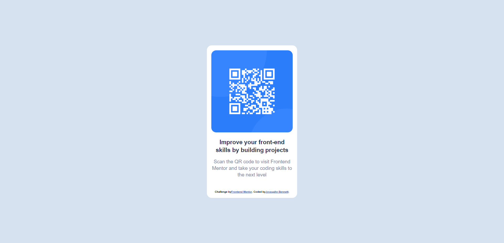

# Frontend Mentor - QR code component solution

This is a solution to the [QR code component challenge on Frontend Mentor](https://www.frontendmentor.io/challenges/qr-code-component-iux_sIO_H). Frontend Mentor challenges help you improve your coding skills by building realistic projects. 

## Table of contents

- [Overview](#overview)
  - [Screenshot](#screenshot)
  - [Links](#links)
- [My process](#my-process)
  - [Built with](#built-with)
  - [What I learned](#what-i-learned)
  - [Continued development](#continued-development)
- [Author](#author)

## Overview

### Screenshot

 view that image.

**Note: Delete this note and the paragraphs above when you add your screenshot. If you prefer not to add a screenshot, feel free to remove this entire section.**

### Links

- Solution URL: [Add solution URL here](https://your-solution-url.com)
- Live Site URL: [Add live site URL here](https://your-live-site-url.com)

## My process

### Built with

- Semantic HTML5 markup
- CSS custom properties
- [Google Fonts](https://fonts.google.com/specimen/Outfit) - For fonts

### What I learned

There are many ways to align and position content. Each requiring its own changes to put things in different locations.

### Continued development

I would like to continue developing my knowledge of beginner CSS work covering all the basics until I can move on to more advanced tasks.

## Author

- Frontend Mentor - [@Jovaughn229](https://www.frontendmentor.io/profile/Jovaughn229)
- Twitter - [@jvn_bnt](https://www.twitter.com/jvn_bnt)
